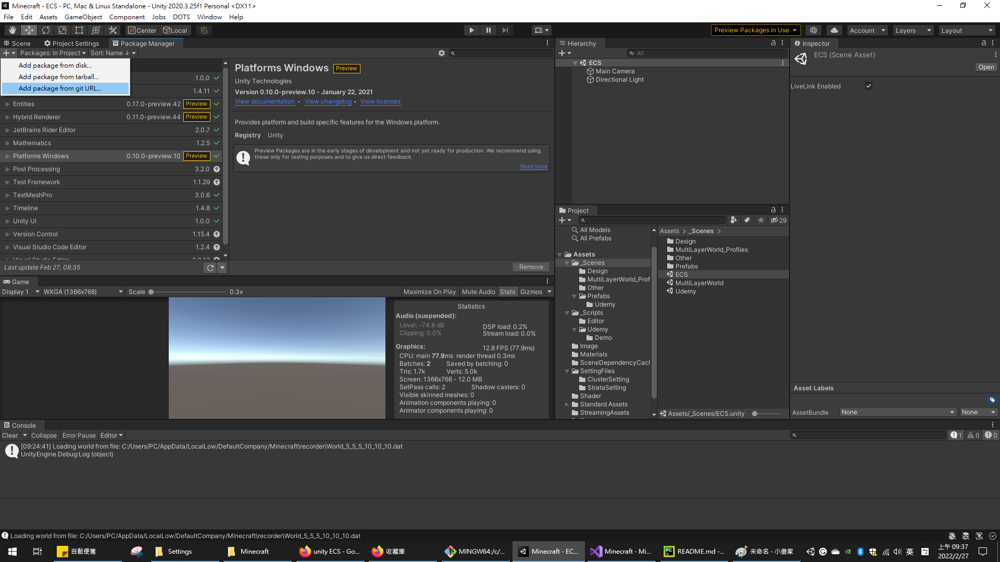
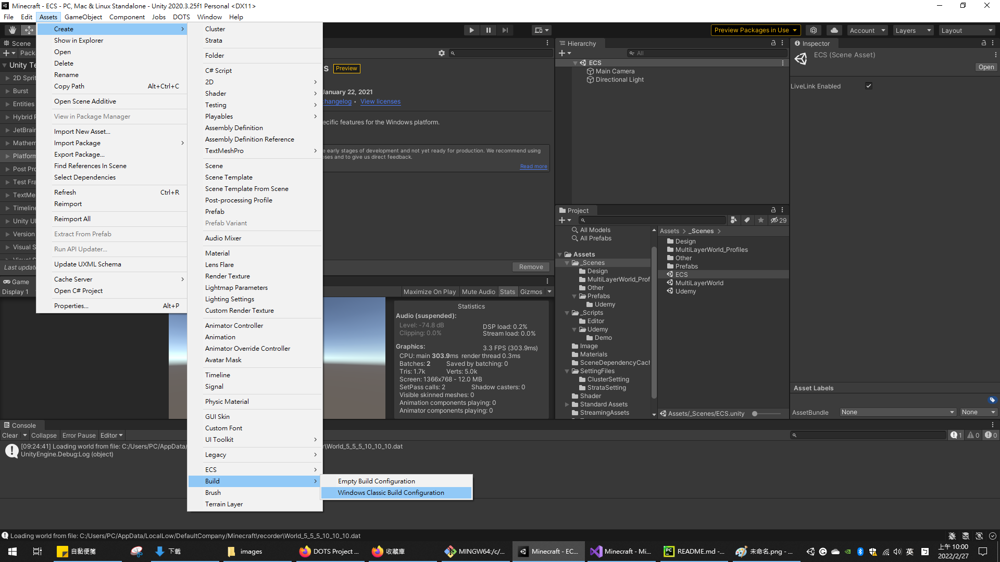
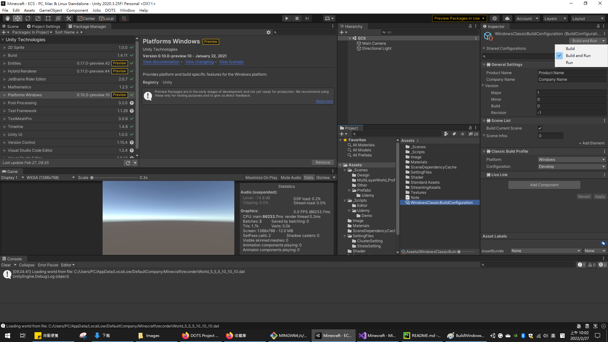
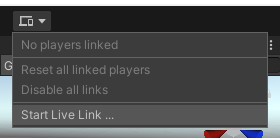

# Minecraft
Unity 當中模仿 Minecraft，建造類似 Minecraft 的遊戲

---

## Entity Component System

The Entity Component System (ECS) is the core of the Unity Data-Oriented Tech Stack(DOTS). As the name indicates, ECS has three principal parts:

[Entities](https://docs.unity3d.com/Packages/com.unity.entities@0.17/manual/ecs_entities.html) — the entities, or things, that populate your game or program.
    
[Components](https://docs.unity3d.com/Packages/com.unity.entities@0.17/manual/ecs_components.html) — the data associated with your entities, but organized by the data itself rather than by entity. (This difference in organization is one of the key differences between an object-oriented and a data-oriented design.)
    
[Systems](https://docs.unity3d.com/Packages/com.unity.entities@0.17/manual/ecs_systems.html) — the logic that transforms the component data from its current state to its next state— for example, a system might update the positions of all moving entities by their velocity times the time interval since the previous frame.

## DOTS Project

### 安裝套件
Unity 在 2020.1 版後，將 DOTS 套件從 PackageManager 中移除(即便允許 preview packages 也找不到)，只能從下列兩個方式來添加：

1. 開啟 PackageManager，按 + 號後選擇 "Add package from git URL..."並輸入套件名稱(例如：`com.unity.entities`)。我就是用這個方法。

2. 直接編輯檔案 Packages\manifest.json，將所需套件名稱寫入(例如：`"com.unity.entities" : "x.x.x-preview.x"`)。這個方法較不建議，畢竟我也不知道最新版的版本號，或是有沒有除了版本號以外需要添加的內容，用方法 1 比較單純。若想自己添加，可以參考 [這個](https://www.jianshu.com/p/566bac7fb67b) 。

### 建議添加的套件 Recommended packages

* com.unity.entities
* com.unity.rendering.hybrid
* com.unity.dots.editor

### Domain Reload

Domain Reload：應該是使得在播放模式下對腳本的 Inspector 做的修改，在結束播放後全部回到播放前的狀態的機制。
隨著腳本越來越多，這個過程耗時越久。

若想關閉此機制，可到 "Edit > Project Settings > Editor"，勾選 "Enter Play Mode Options"，但不選 "Reload Domain" 和 "Reload Scene"(這兩個在勾選 "Enter Play Mode Options" 後變得可以選擇)。

### 獨立建置 Standalone Builds

不清楚這要幹嘛，一樣透過 PackageManager 安裝專案的目標平台所需套件，名稱如下：

* com.unity.platforms.android
* com.unity.platforms.ios
* com.unity.platforms.linux
* com.unity.platforms.macos
* com.unity.platforms.web
* com.unity.platforms.windows (我是裝這個)

安裝完成後，參考下圖產生專案建置的 Config 檔，應該類似於原本的 Build Settings 的作用。

注意!! DOTS 不應使用原本的建置方式("File > Build and Run")，應參照下圖來做建置：

### Live Link Build

不知道這個要幹嘛。In order to connect the editor to a player and have the changes made to the authoring GameObjects synchronized, a Live Link Build has to be created. Simply add the "Live Link" component to the build configuration (and apply the changes).

