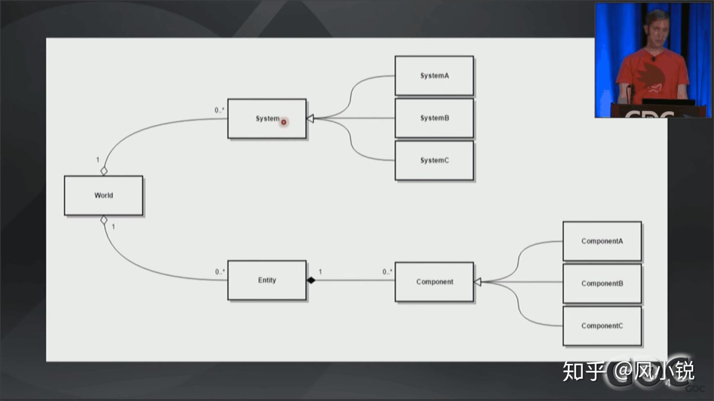

# ECS 基本概念



* 這裡的 Entity 是一個實體，類似於 Unity 中的 GameObject，可以表示遊戲中的單個對象。

* Component 是 Entity 的一個屬性，或者說一個 Entity 是由多個 Component 組合而成的，類似 Unity 中的 Component，但一般定義為一個結構體，不包含任何函數。

* System 來處理含有某些特定 Component 的 Entity 的某一類行為，如一個 MoveSystem 處理所有包含 Position 和 Velocity 組件的 Entity 的移動過程。

這邊最主要區別就是把對象上的數據和行為剝離，由專門的 System 來處理某一種行為，而不是每個對象在自己的一個更新函數中處理所有和自己相關的操作。
當然我們在平時物件導向設計過程中，也會有類似的管理器來處理對象的一部分行為，但 ECS 在架構設計的時候就將需要將這部分操作和需要的數據提前考慮清楚，使得每一個系統的都能符合 ECS 的要求。

---

## Entity

Entity 為 ECS 中基本的成員，實際上只是由一個 Index 和一個 Version 組成，其實際的 Component 數據存儲在一個 Chunk 上。

需要操作其 Component 數據時，根據其 index 到 EntityDataManager 中找到其所在的 Chunk和IndexInChunk，取到對應的 Component 數據後進行操作。

```
public struct Entity : IEquatable<Entity>
{
    public int Index;
    public int Version;
    ......   
}
```

## Component

Component 是 Entity 的一個屬性，一個 Entity 可以包含多個 Component，繼承了 ISharedComponentData 的數據會在多個 Entity 之間共享，
同時可以使用托管類型的成員，一般用來存放 GameObject 或 RenderMesh 等渲染相關的成員。

一個 Entity 的 Component 可以在 CreateEntity 時指定，也可以使用一個 ArcheType 創建或從已有 Entity 複製來創建。
同時已經創建的 Entity 還可以通過 AddComponent 和 RemoveComponent 來動態進行 Component 的添加或刪除(由於效率問題不推薦)。

Tips: Component 可以用 Proxy 包裝後直接掛在 GameObject 上，掛載多個 Proxy 的 GameObject 可以作為 Prefab 直接傳入 EntityManager.Instantiate 來生成新的 Entity，如：

```
// Create an entity from the prefab set on the spawner component.
var prefab = spawnerData.prefab;
var entity = EntityManager.Instantiate(prefab);
```

## ArcheType

Archetype 是一到多個 component 的組合。ECS 在對記憶體做分配時，會將相同的 Archetype 放到同一個 Chunk 當中進行管理。
若對某個 Archetype 實體新增或刪除 component，ECS 也會將它移至相對應的 Chunk 當中。

* ArcheType 管理所有屬於它的 Entity Component 數據，對應數據存放在歸屬於它的 chunk 上
* 可以通過 ArcheType 快速訪問所有該類型的 Entity Component 數據
* 擁有 Component 的 Entity 一定處在某個 ArcheType 的管理之下
* ArcheType 擁有緩存機制，第二次創建相同的 ArcheType 時會自動將現有的返回

我們可以使用 EntityManager.CreateArchetype(params ComponentType[] types) 來主動創建一個 ArcheType，
通過 ArcheType 可以直接調用 EntityManager.CreateEntity(EntityArchetype archetype) 來快速創建具有某一類特征的 Entity。

同時如果使用直接傳入 Components 的方式來創建 Entity 時也會自動生成含有對應 Component 的 ArcheType。

## ComponentSystem

ComponentSystem 為 System 在 Unity ECS 中的實現。
一個 ComponentSystem 會對包含特定的 Component 組合的 Entity(稱為 ComponentGroup，可以通過 GetComponentGroup 主動獲取)執行一些特定的操作，通常繼承自 ComponentSystem 或 JobComponentSystem。

區別是繼承 ComponentSystem 只會在主線程執行，而繼承自 JobComponentSystem 的則可以利用 JobSystem 來進行多線程並發處理，但同時對應操作過程中的限制也更嚴格。
在大部分情況下應當盡量使用 JobComponentSystem 來完成相關的操作，從而提升性能。

多個不同的 ComponentSystem 可以在定義時通過 UpdateBefore、UpdateAfter、UpdateBefored 等標簽來控制其執行順序，這會在一定程度上影響並發執行，通常只在必要時使用。

一個 ComponentSystem 通常關注一個包含特定的 Component 組合的Entity集合(稱為ComponentGroup，下一篇重點講)。，

```
ComponentGroup m_Spawners;

// 獲取包含 ObjectSpawner 和 Position 兩個 Component 的 ComponentGroup
protected override void OnCreateManager()
{
    m_Spawners = GetComponentGroup(typeof(ObjectSpawner), typeof(Position));
}
```

也可以使用 IJobProcessComponentData 中的定義和 RequireSubtractiveComponentAttribute 等標簽自動注入(Inject)，同樣也會生成一個 ComponentGroup

```
// 通過 RequireComponentTagAttribute 為 JobComponentSystem 添加額外的依賴項
// [RequireComponentTagAttribute(typeof(Object))]
// 通過 RequireSubtractiveComponentAttribute 為 JobComponentSystem 添加額外的排除項
[RequireSubtractiveComponentAttribute(typeof(ObjectSpawner))]  
struct ObjectMove : IJobProcessComponentData<Position>
{
    ......
    public void Execute(ref Position position)
    {
        ......
    }
}
```

## Chunk

Chunk 是 Unity ECS 中特有的一個數據結構，在 ECS 部分代碼中有大量使用，通常是指用來存放 Component 信息的與 ArchetypeChunk，
此外還有更一般的 Chunk 通過 ChunkAllocator 進行開辟，可以存放 ArcheType 中的各類型信息，大小和存儲結構都與 ArchetypeChunk 不同，
此處的 Chunk 特指存放 ArcheType 中 Component 信息的 ArchetypeChunk。Chunk 有以下幾個特點：

* 每個 EntityArchetype 都包括了一個 Chunk 的獨特集合
* 一個 Chunk 只能存在於一個 ArcheType 

## EntityManager

ECS 日常使用中使用最頻繁的管理器，每個 World 都會有一個 EnitityManager，不直接儲存數據，但封裝了常用的 Enitity、Archetype、Component 操作，
包括了 CreateEntity、CreateArchetype、Instantiate、AddComponent 等操作。

同時 EntityManager 提供了其他多個重要數據管理器的訪問接口，包括 Entity 數據管理器 EntityDataManager、原型管理器 ArchetypeManager、
Component 集合管理器 EntityGroupManager、以及共享數據管理器 SharedComponentDataManager。

可以說以 EntityManager 為入口，可以延伸到 ECS 系統中 90% 以上的內容，可謂包羅萬象。

## ArchetypeManager

管理所有的 Archetype 的創建、更新、刪除等操作，管理了所有當前已創建的 Archetype。
當需要建立新的 ComponentGroup 時會到 ArchetypeManager 中讀取所有 Archetype 的列表 m_Archetypes，來篩選需要關注哪些 Archetype，
同時在 Archetype 發生變化時也會同時更新對應的 ComponentGroup 數據。

## EntityDataManager

管理所有 Entity 相關的數據，可以通過 m_Entities->ChunkData 快速根據 Entity Index 獲得 Entity 所在的 Chunk 和在該 Chunk 上的 Index，
從 m_Entities->Archetype 獲取其 Archetype，從而快速訪問對應的 Component 數據。


## EntityGroupManager

管理與 ComponentSystem 運作息息相關的 ComponentGroup。從每個 ComponentSystem 中收集其需要關注的 Component 集合，
同時在 System 的每次 Update 前更新這個集合，同樣的集合只會存在一個。


